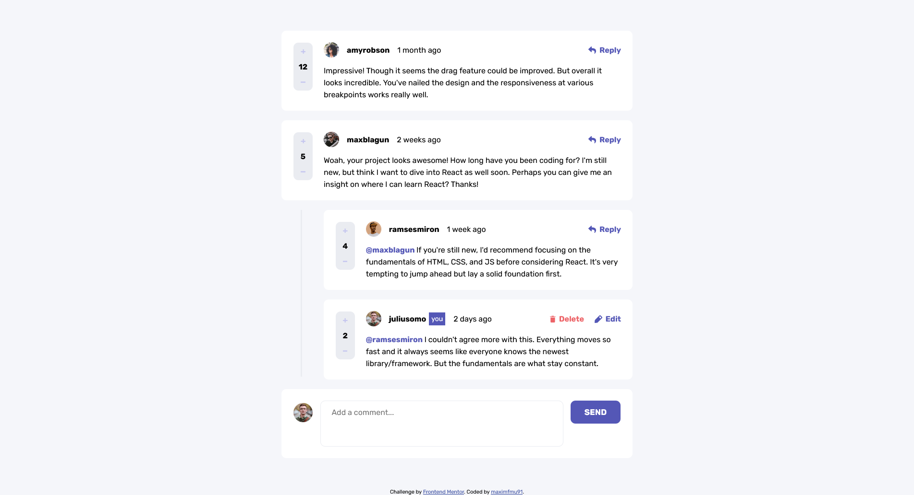

# Frontend Mentor - interactive-comments-section-main solution

This is a solution to the [interactive-comments-section-main challenge on Frontend Mentor](https://www.frontendmentor.io/challenges/interactive-comments-section-iG1RugEG9). Frontend Mentor challenges help you improve your coding skills by building realistic projects. 

### Screenshot

### The challenge

Your users should be able to:

- View the optimal layout for the app depending on their device's screen size
- See hover states for all interactive elements on the page
- Create, Read, Update, and Delete comments and replies
- Upvote and downvote comments
- **Bonus**: If you're building a purely front-end project, use `localStorage` to save the current state in the browser that persists when the browser is refreshed.
- **Bonus**: Instead of using the `createdAt` strings from the `data.json` file, try using timestamps and dynamically track the time since the comment or reply was posted.

- [Add live site URL here](https://maximfmu91.github.io/interactive-comments-section-main/)

### Built with

- Semantic HTML5
- CSS custom properties
- Flexbox
- JavaScript
